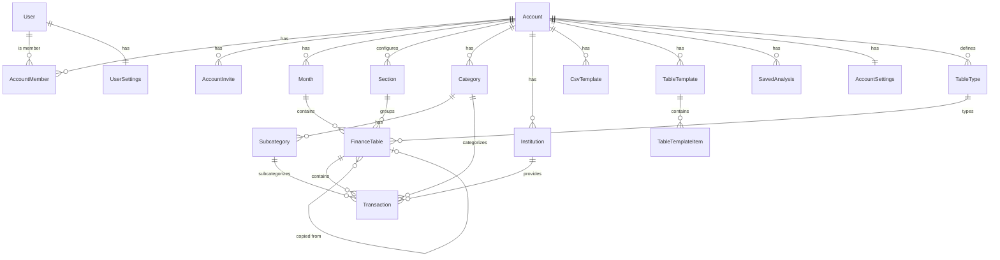

# Spec 01 — Modelo de Domínio

> Skills: [`money-handling`](../skills/money-handling/SKILL.md) · [`prisma-conventions`](../skills/prisma-conventions/SKILL.md) · [`multitenancy`](../skills/multitenancy/SKILL.md) · [`date-timezone`](../skills/date-timezone/SKILL.md)

## 1. Propósito

Define todas as entidades do domínio, seus campos, relacionamentos e regras de negócio. Este documento é a fonte única para o schema do Prisma e para os tipos TypeScript do projeto.

> Quando algo aqui mudar, **o `02-database-prisma.md` precisa ser atualizado em seguida**.

> **Delta pendente (Spec 60 — Atribuição por Persona, ready):** novo agregado `ResponsibleParty` (`personal | group | external`, campo `icon`) + join `ResponsiblePartyMember`. `Transaction.responsibleUserId` → `responsiblePartyId`; `AccountSettings.defaultResponsibleUserId` → `defaultResponsiblePartyId`; `TableTemplateItem.responsibleUserId` → `responsiblePartyId`. Cardinalidade transação→responsável permanece 1. Aplicar aqui ao implementar a Spec 60. Ver `specs/60-atribuicao-responsavel-persona.md`.

## 2. Visão geral das entidades

```
User ─┬─< AccountMember >─┬─ Account ──┬──< Month ──< FinanceTable ──< Transaction
      │                   │            │                    │
      └─< AccountInvite ──┘            ├──< Section ────────┘ (classifies)
                                       ├──< Category ──< Subcategory  (categorizes)
                                       ├──< Institution               (provides)
                                       ├──< TableType ──< FinanceTable (types)
                                       ├──< CsvTemplate
                                       ├──< TableTemplate ──< TableTemplateItem
                                       ├──< SavedAnalysis             (sandbox)
                                       ├──< ChecklistItem ──< ChecklistCompletion >── Month
                                       └──── AccountSettings (1:1)

User ──── UserSettings (1:1)
```

## 3. Entidades

### 3.1 `User`

Pessoa que acessa a aplicação. Gerenciado pelo NextAuth (Prisma Adapter).

| Campo | Tipo | Notas |
|---|---|---|
| `id` | `String` (cuid) | PK |
| `email` | `String` | único, lowercase |
| `name` | `String?` | |
| `image` | `String?` | URL do avatar |
| `emailVerified` | `DateTime?` | NextAuth |
| `passwordHash` | `String?` | null se OAuth-only |
| `createdAt` | `DateTime` | default `now()` |
| `updatedAt` | `DateTime` | auto-update |

**Regras**:
- Email único globalmente.
- Pode existir sem `passwordHash` (usuário só usa Google OAuth).
- NextAuth também cria tabelas auxiliares: `Account` (OAuth), `Session`, `VerificationToken`. **Atenção**: a `Account` do NextAuth ≠ `Account` do nosso domínio. Renomear no schema (ver `02-database-prisma.md`).

### 3.2 `Account`

Grupo de usuários que compartilham dados financeiros.

| Campo | Tipo | Notas |
|---|---|---|
| `id` | `String` (cuid) | PK |
| `name` | `String` | |
| `createdById` | `String` | FK → User |
| `createdAt` | `DateTime` | |

**Regras**:
- Toda Account precisa ter ao menos um membro com role `owner`.
- O `createdBy` é automaticamente adicionado como `owner` ao criar.
- Deletar uma Account deleta em cascata: members, invites, months, sections, categories, institutions, templates, finance_tables, transactions, settings.

### 3.3 `AccountMember`

Associação entre `User` e `Account`, com role.

| Campo | Tipo | Notas |
|---|---|---|
| `accountId` | `String` | FK → Account, PK composta |
| `userId` | `String` | FK → User, PK composta |
| `role` | `AccountMemberRole` | enum |
| `addedById` | `String?` | FK → User |
| `createdAt` | `DateTime` | |

**Enum `AccountMemberRole`**: `owner` | `editor` | `viewer`

**Regras**:
- Um `User` pode ser membro de múltiplas `Account`s.
- Não pode haver dois membros com o mesmo `(accountId, userId)`.
- Pelo menos um `owner` por Account em todo momento (regra de negócio, validar em deletes).

### 3.4 `AccountInvite`

Convite por email para entrar em uma Account.

| Campo | Tipo | Notas |
|---|---|---|
| `id` | `String` (cuid) | PK |
| `accountId` | `String` | FK → Account |
| `email` | `String` | citext, lowercase |
| `role` | `AccountMemberRole` | role pré-definida |
| `status` | `InviteStatus` | enum |
| `invitedById` | `String` | FK → User |
| `createdAt` | `DateTime` | |
| `acceptedAt` | `DateTime?` | |
| `expiresAt` | `DateTime` | default: now + 7 dias |
| `token` | `String` | único, gerado para link |

**Enum `InviteStatus`**: `pending` | `accepted` | `revoked` | `expired`

**Regras**:
- Apenas usuários com role `owner` podem criar invites.
- Email do invite é normalizado para lowercase.
- Se o email já existe como User: aparece como notificação in-app.
- Se não existe: link no email leva para signup → após criar conta, invite aparece para aceitar.
- Invite expira em 7 dias.
- Token usado no link do email.

### 3.5 `Month`

Competência financeira dentro de uma Account.

| Campo | Tipo | Notas |
|---|---|---|
| `id` | `String` (cuid) | PK |
| `accountId` | `String` | FK → Account |
| `year` | `Int` | 2000-2400 |
| `month` | `Int` | 1-12 |
| `createdById` | `String` | FK → User |
| `createdAt` | `DateTime` | |

**Regras**:
- Único por `(accountId, year, month)`.
- Não pode ser duplicado.
- Criado vazio (sem tabelas).
- A label do mês usa o formato `MMM/YYYY` (ex: "Jan/2026") na UI em pt-BR.
- O app sempre abre no Mês mais recente criado.

### 3.6 `Section`

Categoria de organização configurada na Account.

| Campo | Tipo | Notas |
|---|---|---|
| `id` | `String` (cuid) | PK |
| `accountId` | `String` | FK → Account |
| `name` | `String` | único por Account |
| `countType` | `SectionCountType` | enum |
| `order` | `Int` | ordem de exibição |
| `isActive` | `Boolean` | default `true` |
| `createdAt` | `DateTime` | |

**Enum `SectionCountType`**: `add` | `subtract` | `ignore` | `neutral`

> ⚠️ Nome do campo padronizado como `countType` (não `how_to_count` nem `direction`). Specs e código devem usar este nome.

**Regras**:
- Configurada uma vez na Account, aparece em todos os meses.
- Não tem `monthId` (é global por Account).
- `countType`:
  - `add`: valores são somados ao total do mês (independente do sinal).
  - `subtract`: valores são subtraídos do total do mês (independente do sinal).
  - `ignore`: valores não entram no total do mês (mas aparecem na seção).
  - `neutral`: valores entram com o sinal que foi cadastrado (positivo soma, negativo subtrai).
- `isActive=false`: a seção não aparece em meses novos. Em meses antigos que já têm tabelas, aparece em modo somente-leitura.
- Soft-delete via `isActive`. Hard-delete só com modal de confirmação e sem tabelas associadas.

### 3.7 `TableType`

Tipo de tabela financeira — define o nome, visibilidade de colunas e se é o tipo padrão.

| Campo | Tipo | Notas |
|---|---|---|
| `id` | `String` (cuid) | PK |
| `accountId` | `String` | FK → Account |
| `name` | `String` | único por Account |
| `isDefault` | `Boolean` | default `false`. O tipo padrão tem todas as colunas visíveis e não pode ser deletado |
| `hiddenColumns` | `Json` | ex: `{ "investmentType": true }`. Colunas com `true` ficam ocultas |
| `createdAt` | `DateTime` | |

**Regras**:
- Cada Account tem exatamente um `TableType` com `isDefault=true` (criado automaticamente, nome "Manual").
- O tipo padrão não pode ser deletado e `hiddenColumns` é sempre `{}` (todas visíveis).
- Tipos não-default podem ser criados/editados/deletados pelo owner ou editor.
- Não pode deletar um tipo que tenha `FinanceTable`s associadas.
- Ao criar uma Account, são pré-criados 3 tipos: "Manual" (padrão, tudo visível), "Cartão de crédito" (oculta `investmentType`), "Investimentos" (oculta `cardInstallment`).
- **Colunas toggleáveis** (chaves válidas em `hiddenColumns`): `category`, `subcategory`, `institution`, `responsibleUser`, `isPending`, `notes`, `cardInstallment`, `investmentType`, `expenseType`, `tags`, `paymentMethod`. Colunas core sempre visíveis (não toggleáveis): `occurredOn`, `amount`, `description`. Lista canônica de labels em spec 05 §4.5.

### 3.8 `FinanceTable`

Tabela de transações dentro de uma Section de um Month.

| Campo | Tipo | Notas |
|---|---|---|
| `id` | `String` (cuid) | PK |
| `accountId` | `String` | FK → Account |
| `monthId` | `String` | FK → Month |
| `sectionId` | `String` | FK → Section |
| `tableTypeId` | `String` | FK → TableType |
| `name` | `String` | |
| `countInMonth` | `Boolean` | default `true` |
| `sourceMethod` | `TableSourceMethod` | enum |
| `sourceTableId` | `String?` | FK → FinanceTable (self) |
| `displayOrder` | `Int` | default `0` |
| `createdById` | `String` | FK → User |
| `createdAt` | `DateTime` | |
| `updatedById` | `String?` | FK → User |
| `updatedAt` | `DateTime` | auto-update |

**Enum `TableSourceMethod`**: `empty` | `copy` | `import` | `template`

> `template`: tabela criada a partir de um `TableTemplate` da Account. O template define itens recorrentes que são copiados como transações ao criar a tabela.

**Regras**:
- `countInMonth` permite excluir uma tabela específica do cálculo do mês (override da seção).
- `sourceTableId` é populado quando `sourceMethod=copy`. Apenas registro de origem; mudanças na origem não afetam a cópia.
- `tableTypeId` é FK para o `TableType` da mesma Account. Define o nome do tipo exibido e as colunas visíveis na tabela.
- Deletar uma FinanceTable deleta as transações em cascata. **Sempre com modal de confirmação na UI**.

### 3.9 `Transaction`

Linha de dado financeiro.

| Campo | Tipo | Notas |
|---|---|---|
| `id` | `String` (cuid) | PK |
| `accountId` | `String` | FK → Account |
| `monthId` | `String` | FK → Month |
| `tableId` | `String` | FK → FinanceTable |
| `sectionId` | `String` | FK → Section (desnormalizado) |
| `occurredOn` | `Date` | data da transação |
| `amountCents` | `BigInt` | valor em centavos |
| `description` | `String?` | |
| `notes` | `String?` | |
| `isPending` | `Boolean` | default `false` |
| `isFavorite` | `Boolean` | default `false` |
| `categoryId` | `String?` | FK → Category |
| `subcategoryId` | `String?` | FK → Subcategory |
| `institutionId` | `String?` | FK → Institution |
| `institutionText` | `String?` | fallback livre |
| `responsibleUserId` | `String?` | FK → User |
| `cardInstallment` | `String?` | ex: "3/12" |
| `investmentType` | `String?` | |
| `paymentMethod` | `TransactionPaymentMethod?` | enum **fixo** nullable — método de pagamento. Ver spec 41 TRN-11 |
| `metadata` | `Json` | default `{}` |
| `createdById` | `String` | FK → User |
| `createdAt` | `DateTime` | |
| `updatedById` | `String?` | FK → User |
| `updatedAt` | `DateTime` | auto-update |

**Regras**:
- `amountCents` é `BigInt`. **Nunca** usar `Float`/`Decimal` no domínio. Ver `skills/money-handling/SKILL.md`.
- `sectionId` é desnormalizado (vem do `tableId`) para acelerar queries agregadas. **Triggers ou middleware Prisma garantem consistência**.
- `subcategoryId` requer `categoryId` correspondente (validar no Zod schema).
- Se `institutionId` está preenchido, `institutionText` é ignorado (institutionId tem prioridade).
- `responsibleUserId` precisa ser membro da Account.
- `metadata` aceita JSON arbitrário para extensões futuras (validado por Zod schemas específicos por `tableTypeId`).
- `paymentMethod` é um **enum fixo** (não é model gerenciável — sem settings/CRUD/seeding), análogo a `expenseType`.

**Enum `TransactionPaymentMethod`**: `pix` | `cash` | `credit_card` | `debit_card` | `bank_transfer` | `boleto` | `other` (`@@map("transaction_payment_method")`).

### 3.10 `Category` e `Subcategory`

```
Category(accountId, name) ─< Subcategory(categoryId, name)
```

**Category**:
| Campo | Tipo | Notas |
|---|---|---|
| `id` | `String` (cuid) | PK |
| `accountId` | `String` | FK → Account |
| `name` | `String` | único por Account |
| `createdById` | `String` | FK → User |
| `createdAt` | `DateTime` | |

**Subcategory**:
| Campo | Tipo | Notas |
|---|---|---|
| `id` | `String` (cuid) | PK |
| `categoryId` | `String` | FK → Category |
| `accountId` | `String` | FK → Account (desnormalizado) |
| `name` | `String` | único por Category |
| `createdAt` | `DateTime` | |

**Regras**:
- Subcategory tem `accountId` desnormalizado para facilitar queries diretas e RLS-like filtros.
- Deletar Category → Subcategories deletam em cascata.
- Transações com `categoryId/subcategoryId` deletados ficam com null (`ON DELETE SET NULL`).

### 3.11 `Institution`

Instituição financeira (banco, corretora, etc.) configurada na Account.

| Campo | Tipo | Notas |
|---|---|---|
| `id` | `String` (cuid) | PK |
| `accountId` | `String` | FK → Account |
| `name` | `String` | único por Account |
| `createdById` | `String` | FK → User |
| `createdAt` | `DateTime` | |

### 3.12 `CsvTemplate`

Mapeamento salvo de colunas para importação.

| Campo | Tipo | Notas |
|---|---|---|
| `id` | `String` (cuid) | PK |
| `accountId` | `String` | FK → Account |
| `name` | `String` | único por Account |
| `mapping` | `Json` | mapa de colunas |
| `createdById` | `String` | FK → User |
| `createdAt` | `DateTime` | |

**Schema do `mapping`** (Zod):
```ts
const mappingSchema = z.object({
  date: z.string(),              // nome da coluna no CSV
  amount: z.string(),
  description: z.string().optional(),
  category: z.string().optional(),
  institution: z.string().optional(),
  dateFormat: z.string().default("DD/MM/YYYY"),
  amountFormat: z.enum(["brl", "us"]).default("brl"),
  // ...
});
```

### 3.13 `AccountSettings`

Configurações de uma Account (1:1 com Account).

| Campo | Tipo | Notas |
|---|---|---|
| `accountId` | `String` | PK, FK → Account |
| `currency` | `String` | default `"BRL"` |
| `monthStartDay` | `Int` | 1-31, default `1` |
| `defaultResponsibleUserId` | `String?` | FK → User |
| `createdAt` | `DateTime` | |
| `updatedAt` | `DateTime` | auto-update |

**Regras**:
- Criada automaticamente ao criar uma Account (defaults).
- `monthStartDay`: define quando o mês começa para fins de agregação. Ver `skills/date-timezone/SKILL.md`.

### 3.14 `UserSettings`

Configurações pessoais de um User (1:1 com User).

| Campo | Tipo | Notas |
|---|---|---|
| `userId` | `String` | PK, FK → User |
| `theme` | `String` | `light` / `dark` / `system`, default `system` |
| `locale` | `String` | default `pt-BR` |
| `timezone` | `String` | default `America/Sao_Paulo` |
| `createdAt` | `DateTime` | |
| `updatedAt` | `DateTime` | auto-update |

**Regras**:
- Criada no primeiro login (defaults).
- `timezone` é usado para conversão de datas no client.

### 3.15 `SavedAnalysis`

Análise ad-hoc salva pelo usuário no Sandbox. Ver `specs/17-sandbox.md` para detalhes completos.

| Campo | Tipo | Notas |
|---|---|---|
| `id` | `String` (cuid) | PK |
| `accountId` | `String` | FK → Account |
| `createdById` | `String` | FK → User |
| `name` | `String` | único por Account |
| `config` | `Json` | `SandboxConfig` serializada |
| `isPinned` | `Boolean` | default `false` — fixar no dashboard |
| `pinnedOrder` | `Int` | default `0` — ordem entre fixadas |
| `dashboardContext` | `String` | `"yearly"` \| `"monthly"` \| `"both"` |
| `createdAt` | `DateTime` | |
| `updatedAt` | `DateTime` | auto-update |

**Regras**:
- Qualquer membro (owner/editor/viewer) pode criar e salvar análises.
- Análises são visíveis para todos os membros da Account.
- Apenas o criador ou um `owner` pode deletar.
- Máximo de 4 análises fixadas por Account. `dashboardContext` define em qual dashboard a análise aparece quando fixada.

### 3.16 `TableTemplate`

Template de tabela financeira — define um conjunto de transações recorrentes que podem ser aplicadas ao criar uma `FinanceTable` com `sourceMethod=template`.

| Campo | Tipo | Notas |
|---|---|---|
| `id` | `String` (cuid) | PK |
| `accountId` | `String` | FK → Account |
| `name` | `String` | único por Account |
| `description` | `String?` | descrição opcional |
| `tableTypeId` | `String?` | FK → TableType (opcional) |
| `countInMonth` | `Boolean` | default `true` |
| `createdById` | `String` | FK → User |
| `createdAt` | `DateTime` | |
| `updatedAt` | `DateTime` | auto-update |

**Regras**:
- Templates são por Account; qualquer membro pode criar.
- Ao aplicar um template, seus `items` são copiados como `Transaction`s na nova tabela.
- Deletar um template não afeta tabelas já criadas a partir dele.

### 3.17 `TableTemplateItem`

Item (transação recorrente) pertencente a um `TableTemplate`.

| Campo | Tipo | Notas |
|---|---|---|
| `id` | `String` (cuid) | PK |
| `templateId` | `String` | FK → TableTemplate |
| `accountId` | `String` | FK → Account (desnormalizado) |
| `day` | `Int` | dia do mês (1–31) |
| `amountCents` | `BigInt` | valor em centavos |
| `description` | `String?` | |
| `isPending` | `Boolean` | default `false` |
| `categoryId` | `String?` | FK → Category |
| `subcategoryId` | `String?` | FK → Subcategory |
| `institutionId` | `String?` | FK → Institution |
| `responsibleUserId` | `String?` | FK → User |
| `cardInstallment` | `String?` | |
| `investmentType` | `String?` | |
| `displayOrder` | `Int` | default `0` |
| `createdAt` | `DateTime` | |

**Regras**:
- Deletar o `TableTemplate` pai deleta os itens em cascata.
- `accountId` desnormalizado para facilitar queries multi-tenant.

### 3.18 `ChecklistItem`

Tarefa recorrente do checklist mensal, compartilhada pela Account (template). Aparece em qualquer mês; ver widget `checklist` no spec 36.

| Campo | Tipo | Notas |
|---|---|---|
| `id` | `String` (cuid) | PK |
| `accountId` | `String` | FK → Account |
| `label` | `String` | único por Account (`@@unique([accountId, label])`) |
| `position` | `Int` | ordem de exibição |
| `createdById` | `String` | FK → User |
| `createdAt` | `DateTime` | |
| `updatedAt` | `DateTime` | |

**Regras**:
- Deletar o item remove suas `ChecklistCompletion` em cascata (some de todos os meses).
- Add/rename/reorder/delete é papel **owner/editor** (viewer read-only).

### 3.19 `ChecklistCompletion`

Estado de conclusão de um `ChecklistItem` num `Month` específico. **Linha presente = concluído; ausência = pendente** — o toggle é create/delete, e o reset por mês é grátis (não há coluna de âncora de mês).

| Campo | Tipo | Notas |
|---|---|---|
| `id` | `String` (cuid) | PK |
| `accountId` | `String` | FK → Account (desnormalizado p/ filtro tenant) |
| `itemId` | `String` | FK → ChecklistItem (cascade) |
| `monthId` | `String` | FK → Month (cascade) |
| `completedById` | `String` | FK → User |
| `transactionId` | `String?` | FK → Transaction, **`onDelete: SetNull`** — vínculo unilateral opcional (a transação que cumpriu a tarefa no mês) |
| `createdAt` | `DateTime` | |

**Regras**:
- `@@unique([itemId, monthId])` — no máximo uma linha por item por mês. Toggle on = `upsert`; off = `deleteMany` (idempotente, evita P2002).
- Guarda tenant **write-time**: `toggleCompletion` verifica `item.accountId === ctx.accountId` **E** `month.accountId === ctx.accountId` antes de inserir (itemId/monthId forjado não pode criar completion cross-tenant).
- Cascade em delete de item/month/account.
- **Vínculo de transação (unilateral)**: o vínculo mora só neste lado (o FK está em `checklist_completions`; a tabela `transactions` não ganha coluna). `linkTransaction` verifica item, mês **e** transação ∈ account, exige `tx.monthId === monthId`, e faz `upsert` da conclusão com `transactionId` → **vincular marca concluído**. `unlinkTransaction` zera `transactionId` mantendo a conclusão. Deletar a transação (`onDelete: SetNull`) apenas limpa o vínculo.

## 4. Diagrama (referência visual)

> Vou manter a versão consolidada aqui. Quando ferramentas como `mermaid` forem usadas, este bloco é a referência.



## 5. Resoluções de inconsistências do MVP antigo

Para histórico, decisões tomadas em relação aos rascunhos anteriores (`sql_my_accountant.txt`, `Diagrama de Classe.txt`):

| Conflito | Decisão |
|---|---|
| `family` vs `account` | **`Account`** em todo o projeto. |
| `how_to_count` vs `direction` vs `section_amount_count` | Campo: **`countType`**. Enum: **`SectionCountType`**. |
| `highlight` vs `favorite` em Transaction | **`isFavorite`** (boolean). |
| `count_in_month` em Section ou em FinanceTable | **Existe em ambos**. Section define o default; FinanceTable.countInMonth pode sobrescrever (false = excluir aquela tabela do total mesmo se a seção contar). |
| `source_table_id` sem FK declarada | **Adicionar FK self-referencing** com `ON DELETE SET NULL`. |
| `subcategory` sem `account_id` | **Desnormalizar `accountId`** em Subcategory. |
| Auth users (Supabase) | Substituído por **`User`** gerenciado pelo NextAuth. |

## 6. Mudanças futuras (deixar registrado)

> Quando mudar algo no domínio, registre aqui antes de implementar.

| Data | Mudança |
|---|---|
| 2026-06-01 | `FinanceTable.tableType: String` substituído por `FinanceTable.tableTypeId: String` (FK → `TableType`). A configuração global de colunas (`AccountSettings.hiddenColumns`) foi removida e centralizada no novo modelo `TableType`. Cada `TableType` define quais colunas ficam visíveis nas tabelas que o utilizam. |
| 2026-06-02 | Nova entidade `SavedAnalysis` — análises ad-hoc salvas do Sandbox. Requer migração Prisma. Ver `specs/17-sandbox.md`. |
| 2026-06-02 | `SavedAnalysis` recebeu campos `isPinned`, `pinnedOrder` e `dashboardContext` — suporte a fixar análises no dashboard mensal/anual. |
| 2026-06-02 | Novas entidades `TableTemplate` + `TableTemplateItem` — modelos de tabela com transações recorrentes. Novo valor `template` em `TableSourceMethod`. |
| 2026-06-02 | `UserSettings.accentColor` — preferência de cor de destaque por usuário (10 presets). |
| 2026-07-04 | Novas entidades `ChecklistItem` (template recorrente por Account) + `ChecklistCompletion` (estado por mês, linha-presente = concluído). Suportam o widget `checklist` exclusivo do Resumo do Mês (spec 36). Migração `add_monthly_checklist`. |
| 2026-07-05 | `ChecklistCompletion.transactionId` (FK opcional → Transaction, `onDelete: SetNull`) — vínculo unilateral de uma transação a um item do checklist (vincular marca concluído). Migração `checklist_completion_transaction_link`. |
